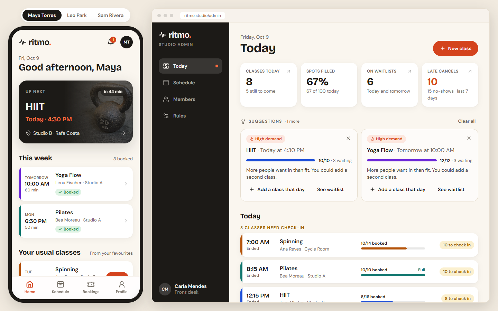

# Ritmo

Class booking for a local gym. Members book, cancel and join waitlists from their phone, freed spots are filled automatically under rules the studio controls, and the front desk sees every class at a glance.

An interactive, frontend-only prototype that comes with a requirements document and a demo script.

- **Prototype:** [ritmo-app-bay.vercel.app](https://ritmo-app-bay.vercel.app)
- **Requirements:** [docs/PRD.pdf](docs/PRD.pdf) (Product Requirements Document)
- **Demo script:** [docs/DEMO.md](docs/DEMO.md) (short version below)



*Left: a member's home on a phone. Right: the front desk's Today view. One action shows up on both sides. The sample data is generated around the current date.*

## Run it

Requires Node 20 or newer.

```bash
npm install
npm run dev     # http://localhost:5173
npm test        # booking, waitlist and studio rules (Vitest)
npm run build   # production build in dist/
```

## Try it

There is no login on purpose. Pick a profile on the first screen, or switch at any time in the dark bar at the top. **Side by side** (wide screens) shows the member's phone next to the admin, so one action updates both. **Reset demo** restores the sample data.

| Profile | What to look at |
|---|---|
| **Maya**, member | Her week: a class in about an hour, a full class tomorrow, favourites ready to book |
| **Leo**, member | First on the waitlist for both of Maya's classes: sees automatic promotion and open-spot alerts |
| **Sam**, new member | First day: nothing booked, no favourites; empty states and suggestions |
| **Carla**, studio admin | Today's overview, schedule by week, month and room, check-in, members, studio rules |

## Demo script (short)

The full version, with what to say at each step, is in [docs/DEMO.md](docs/DEMO.md). Click **Reset demo** before starting.

1. **Maya's week.** Home (*Up next*, *This week*, *Your usual classes*), schedule filters, booking a class (its rules and **Add to calendar** appear once booked), the notification inbox and reminder settings.
2. **A freed spot fills itself.** Side by side with Leo. As Maya, cancel tomorrow's full class: Leo is booked automatically and notified, and the roster updates.
3. **Inside the 2-hour cutoff.** Reset, then as Maya cancel her *Up next* class (about an hour away): a late-cancel warning. Leo sees *A spot opened* and books it himself; nobody is booked without being asked.
4. **The front desk.** As Carla: the indicators, suggestions, check-in with *Mark all as here*, **New class** (starts at the first free slot, warns of clashes), the Rooms view, and Members (*Needs attention*, *Inactive*).
5. **The studio's rules.** **Rules** page; then open `/admin?scenario=spot-held` to see a spot held for the front desk and give it from the waitlist.
6. **A new member.** Sam's first-day home, and the *New* badge in admin Members.
7. **Close** with what is out of scope and the open questions in the PRD.

## What is in the prototype

**Member (phone first):** home with routine and suggestions, two-week schedule with filters, class detail with rules in plain words, booking with undo, overlap warning, waitlist with position, claiming an open spot, late-cancel confirmation, favourites, notifications with clear and undo, email preview, reminder and email settings, add to calendar (.ics).

**Admin (desktop first, works on a phone):** today's overview with linked indicators, suggestions, spots to give, check-in; schedule by week, month and room with filters and display options; class panel with roster, waitlist, give spot, change instructor, edit and cancel; new-class form with room availability and clash warnings; members list with attention and inactive segments; studio rules.

## How it works

- **Frontend only.** Sample data lives in the browser (localStorage) and is regenerated around today's date, so the demo situations exist on any day. About 90 members, five class types, six instructors, four rooms, 30 days of history and 45 days ahead.
- **Real rules, not scripted screens.** Capacity, ordered waitlists, automatic promotion, the cutoff, late cancellations, check-in and the notifications each event produces are plain functions in [src/domain/rules.ts](src/domain/rules.ts), covered by tests. They could move to a server unchanged.
- **Nothing is sent.** Notifications appear in the app with an email preview.
- **Scenarios.** `?scenario=spot-held` opens a ready-made situation (see [src/scenarios.ts](src/scenarios.ts)).

```
src/
  domain/     types, rules (+ tests), sample data, catalog
  member/     member app: home, schedule, class detail, bookings, inbox, profile
  admin/      admin: today, schedule, class panel and form, members, rules
  components/ shared UI: buttons, sheets, selects, date and time pickers
```

## Deploy

Any static host works. On Vercel, import the repo and keep the defaults (build `npm run build`, output `dist`). `vercel.json` sends every route to the app. If the domain changes, update the absolute `og:image` and `og:url` in `index.html` so link previews keep working.

## Stack

Vite, React, TypeScript, Tailwind CSS, Zustand, Motion, lucide-react, Vitest.

## Image credits

Class photos in `public/img` are public-domain images found through Openverse:

| File | Source | Licence |
|---|---|---|
| `spin.jpg` | Flickr, "Firenza Indoor Cycling Ortus Fitness" | Public Domain Mark |
| `pilates.jpg` | StockSnap, "Woman Stretch" | CC0 |
| `muay.jpg` | rawpixel | CC0 |
| `yoga.jpg` | StockSnap, "Woman Yoga" | CC0 |
| `hiit.jpg` | rawpixel, "Closeup gym kettlebell gym floor" | CC0 |

Instructor portraits in `public/img/instructors` are AI-generated (ChatGPT) and used only for this demo; they are not real people. Kai Tanaka has no photo on purpose, to show the initials fallback.
